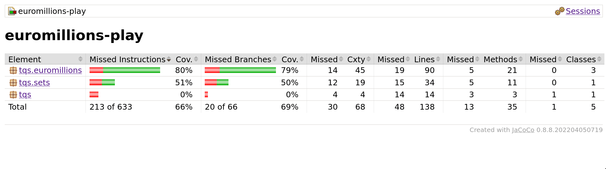
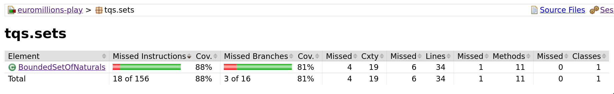

# Lab 1

This `README` contains answers to certain questions.


## 2. c) Access coverage level in project "Euromillions-play"

By running `mvn clean test jacoco:report`, we get an HTML file (at `target/site/index.html`) reporting the coverage level of tests for each class.

Result:



The classes/methods that provide less coverage are inside the `tqs.sets` package. The `BoundedSetOfNaturals` class is not being tested thoroughly.

## 2. d) Unit tests worth writing

These are the tests I gathered:

```
- Adding a natural number should increase size by 1 and the set should contains() that value
- Adding a number that already exists throws IllegalArgumentException
- Adding a number to a full set throws IllegalArgumentException
- Adding a non-natural number should throw an IllegalArgumentException
- Creating a set from an array with invalid numbers should throw an IllegalArgumentException error
- Adding to an array that would exceed maximum size of set throws IllegalArgumentException
- Two sets with different values return false for intersects()
- Two sets with a common value return true for intersects()
```

## 2. e) Coverage after new tests were added



The missing 12% coverage origin from lack of testing in `equals()` and `hashCode()` methods. 