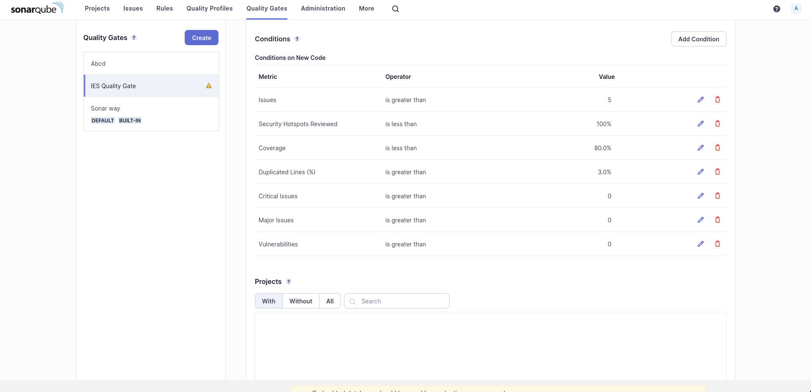

# Lab 6

## SonarQube Docker Command

`$ docker run -d --name sonarqube -e SONAR_ES_BOOTSTRAP_CHECKS_DISABLE=true -p 9000:9000 sonarqube:latest`

6.1 Token: `sqp_9db2eb488c20e9e36694b007ed9354e0b6ea081d` 
6.2 Token: `sqp_026f0069d8dc8016650d164aee8756d899a01b52`

## Lab 6.1 E)

- It passed the quality gate since the quality gate checks new code quality, and this is not new code.
- But the code shouldn't pass the quality gate, since the default quality gate defines these requirements:
    - New code has 0 issues
    - All new security hotspots are reviewed
    - New code is sufficiently covered by test - 80% or more
    - New code has limited duplication - 4% or less

- The code for the Euromillions project does not pass the first 3 requirements. It has 25 issues, only 73.5% coverage and has 1 security hotspot by using a cryptographically insecure random number generator.

## Lab 6.1 F)

| **Issue**     |**Problem Description**  | **How to Solve**  |
|---------------- | --------------- | --------------- |
| RNG Security Issue | Usage of `java.util.Random.Random()` as a random number generator. It is not cryptographically secure, and `java.security.SecureRandom` package should be used instead. It could pose a big risk if this was a real application and someone could predict the output of the Euromillions numbers :) | Use `java.security.SecureRandom` instead, which |
| Code smell (minor) | Returning `ArrayList` instead of the generic interface `List`. It's a maintainability issue. We should always return the generic interface instead of a specific implementation of it.  | Changing the return type from `ArrayList<type>` to `List<type>` |
| Code smell (major) | Concatenating strings that call methods inside of logger methods. These will be evaluated, even if the logging level is not met, which results in a performance loss. For example, when not running an app in debug mode, the concatenation would be evaluated. | Change concatenations to use supplier functions. For example, instead of `logger.log(Level.DEBUG, "Something went wrong: " + message);`, use `logger.log(Level.DEBUG, () -> "Something went wrong: " + message");`|

## Lab 6.2 A)

- Technical debt found - 1h46m worth
- It represents the cost (in terms of time) of solving all the issues listed, on average.

## Lab 6.2 B)

- After fixing the major and critical code smells, running the linter showed the following results:

- The number of issues went down, now all there is are minor and "info" code smells.

## Lab 6.2 C)

- The code coverage is at 78.1%

- There are 17 uncovered lines (out of total 80) and 4 uncovered conditions

- These values are not necessarily bad, as uncovered lines could be hashCode, toString and similar methods. 
- But in this case, the uncovered lines are business logic code, handling cases of invalid behaviour (passing null to certain functions, for example), so it would ideally be covered aswell in testing.

## Lab 6.3 A)

- The defined quality gate:

    - At most, 5 general issues, since missing 2 or 3 of unused imports in code doesn't instantly mean it should fail the quality gate and require a commit to fix
    - At least 80% code coverage - obviously, in IES we have 0% code coverage, since we didn't test our solution, but it's important either way. 80% means we want most code covered, but not every single line, since some lines could be debug related (toString() methods, for example).
    - All security hotspots should be reviewed when new code is inserted - security is extremely important and no possible vulnerabilities should be left in code.
    - At most 3% duplicated lines. We should, for example, abstract code that is used multiple times in method calls, to improve readability and reduce the amount of code in a codebase.
    - At most 0 critical issues - these may be dangerous vulnerabilities (for example, serialization related issues) or really bad for the maintainability of code (for example, lower case CONSTANTS).
    - At most 0 major issues - these may also be security vulnerabilities or maintainability issues and will amount to a lot of technical debt if not dealt with.
    - At most 0 vulnerabilities, security should be taken seriously.
